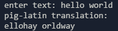

# Pig Latin Translator

simple translator that translates english to pig-latin. to use it download the source code from the github release and run the `main.py` file. you can use the cli to use the translator.

